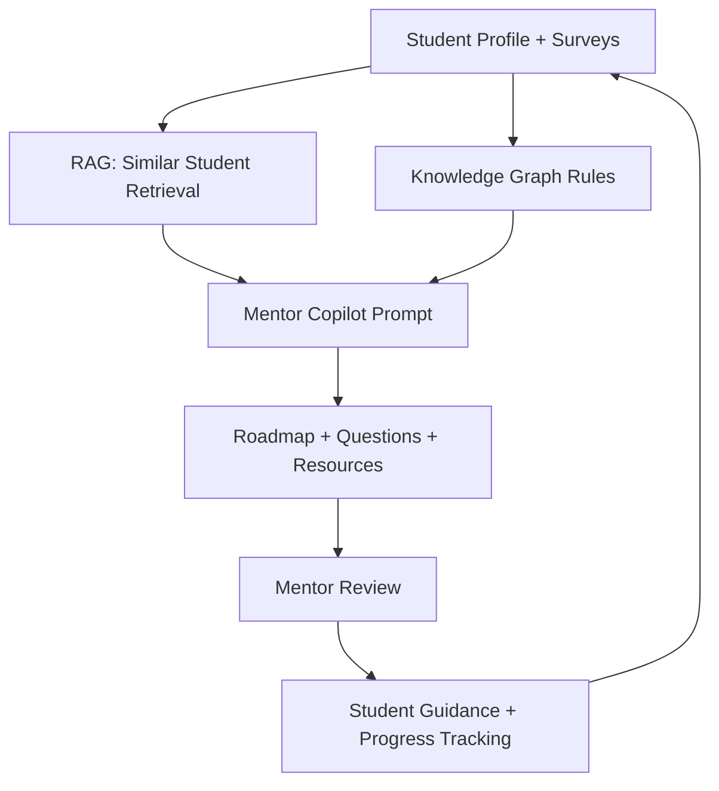
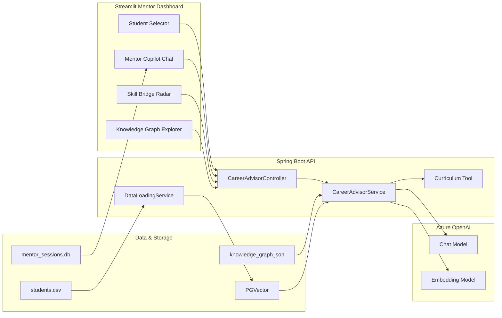
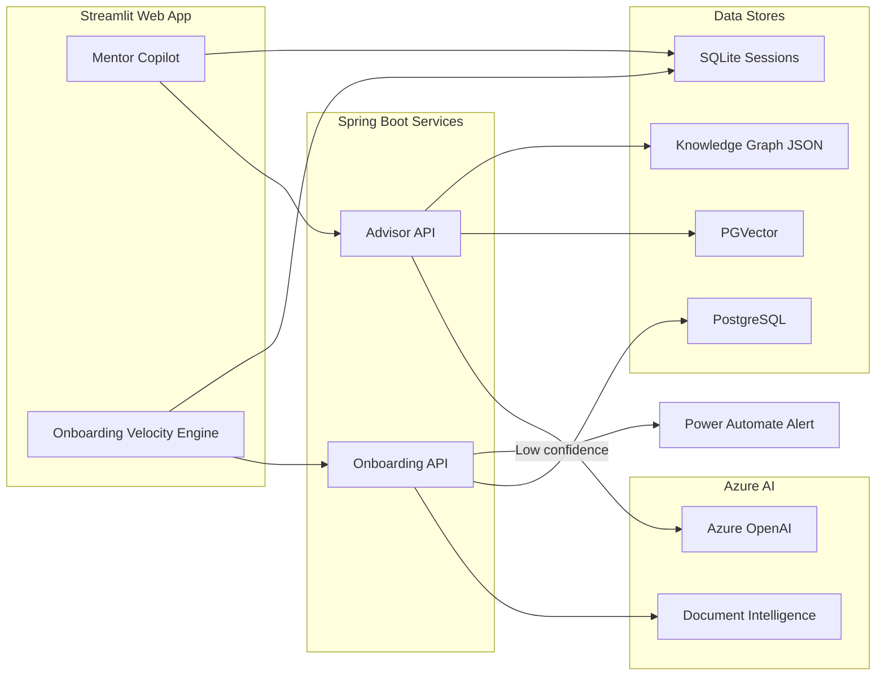

# MentorBridge (Graph‑RAG Mentor Copilot)

This is a **hands‑on exploration project**, inspired by a hackathon use‑case.
It is **not** an official submission and **not** a production product.

The goal is learning:

* how Azure AI services fit together
* how RAG + lightweight Knowledge Graphs improve guidance
* how AI can reduce *operational friction* without removing humans

The demo context represents a **generic youth mentorship and skilling organization**.

---

## Why This Project Exists

This project explores two real problems:

1. **Mentor decision fatigue**
2. **Slow, manual onboarding workflows**

Instead of solving them with a single chatbot, we split responsibilities clearly.

---

## What This App Does (At a Glance)

* Dual‑purpose web app:

  * **Mentor Copilot** (guidance + reasoning)
  * **Onboarding Velocity Engine** (document verification)

* Mentor dashboard with:

  * student selector
  * session persistence (SQLite)

* AI‑assisted reasoning using:

  * RAG over `students.csv`
  * JSON Knowledge Graph rules

* Automated document verification using:

  * Azure AI Document Intelligence
  * human‑in‑the‑loop escalation on low confidence

---

## Tech Stack (Why Each Piece Exists)

### Backend

* **Spring Boot** – orchestration + business logic
* **Spring AI** – structured LLM access
* **Azure OpenAI** – reasoning + explanation
* **PGVector** – similarity search (RAG)

### Frontend

* **Streamlit** – fast, explainable UI for demos

### Storage

* **SQLite** – mentor chat sessions
* **PostgreSQL** – student profiles + vectors

---

## Quickstart (Run Locally)

### 1) Backend

```bash
mvn spring-boot:run
```

If this fails, nothing else will work.

---

### 2) Frontend

```bash
streamlit run app.py
```

Open the URL shown in the terminal.

---

### 3) UI Dependencies

```bash
pip install plotly streamlit-agraph
```

---

## Required Environment Variables

```bash
export AZURE_OPENAI_ENDPOINT="https://<your-resource>.openai.azure.com/"
export AZURE_OPENAI_API_KEY="<your-key>"
export AZURE_OPENAI_CHAT_DEPLOYMENT="gpt-4o"
export AZURE_OPENAI_EMBEDDING_DEPLOYMENT="text-embedding-ada-002"
```

Only Azure OpenAI is required to demo the Mentor Copilot.

---

## Project Structure (Mental Map)

* `app.py`

  * Streamlit mentor dashboard + onboarding UI

* `src/main/java/...`

  * Spring Boot APIs

* `src/main/resources/students.csv`

  * synthetic student profiles

* `src/main/resources/knowledge_graph.json`

  * interest → trait → skill → role rules

* `mentor_sessions.db`

  * mentor chat history (SQLite)

---

## Mentor Copilot – Process Flow



**Key idea:**
AI assists mentors, mentors remain accountable.

---

## Mentor Copilot – Architecture



---

## Onboarding Velocity Engine

This module accelerates learner onboarding while keeping humans in control.

### What It Does

* Captures Aadhaar, PAN, and income documents
* Extracts fields using **Azure AI Document Intelligence**
* Applies confidence‑based verification rules
* Escalates uncertain cases for human review

---

### Required Environment Variables

```bash
export AZURE_DOCINTEL_ENDPOINT="https://<your-resource>.cognitiveservices.azure.com"
export AZURE_DOCINTEL_KEY="<your-key>"
export POWER_AUTOMATE_WEBHOOK_URL="<your-flow-http-trigger-url>"
```

---

### Document Verification Logic (Current)

1. Azure Document Intelligence extracts:

   * FullName
   * DateOfBirth
   * DocumentNumber
   * Income (if present)

2. Java validation checks:

   * Normalized document name must match `student_profiles.full_name`
   * Confidence score must be **≥ 0.90**

3. If any confidence < 0.90:

   * A webhook is sent for human review

---

## Dual‑Purpose Architecture (Mentor + Onboarding)



---

## Important Notes

* This is a **learning prototype**
* No model fine‑tuning is performed
* All logic is explainable and inspectable

If you can explain:

* what problem is solved
* why AI is used
* where humans stay in control

Then the system is doing its job.
